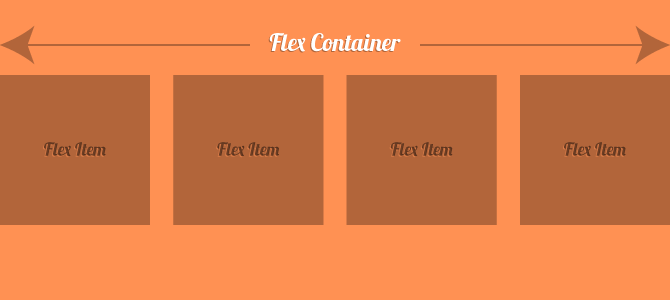

# FlexBox

The Flexible Box Module, usually referred to as flexbox, was designed as a one-dimensional layout model, and as a method that could offer space distribution between items in an interface and powerful alignment capabilities. 

Understanding FlexBox is important to the overall conversation about grids and layouts because it is powerful and dramatic tool not just for moderan webpages but also mobile-friendly webpages. 

FlexBox centers around two main pieces of terminology: the container and its children known as items. The properites for each are different. This repo attempts to break the terminology down into friendly lessons and code to help in your understanding of my good friend FlexBox. 

